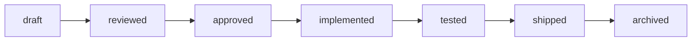

# AI Team Protocol

This is the public documentation entry point for the `.ai/` protocol.

The source of truth installed into projects is [.ai/protocol.md](../.ai/protocol.md).

## Current status

- **AI Team release**: 0.2.1
- **Protocol version**: 0.2-draft

`v0.2.1` includes the draft `0.2` protocol. The protocol is usable, but not frozen yet.

## Lifecycle

## Core idea

Agents coordinate by reading and writing files:

- `.ai/context/*` for stable project context;
- `.ai/state/*` for active work state;
- `.ai/workflows/*` for process;
- `.ai/roles/*` for role behavior;
- `.ai/templates/*` for artifact formats.

See [.ai/protocol.md](../.ai/protocol.md) for the full protocol.
